<div align="center">

# Go Ride — Ride-Hailing Simulator

**Run a whole ride-hailing city in one browser: riders, drivers and a live map, all talking to the real Go microservices.**


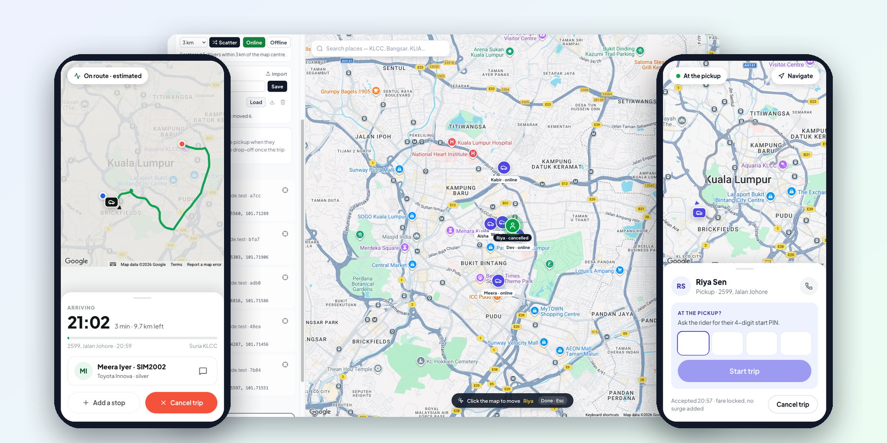

</div>

---

## What is this?

Go Ride is a ride-hailing platform built as a set of Go microservices (auth, dispatch, driver trips, location
ingestion, a websocket gateway) with React Native rider and driver apps. Testing a ride on phones means two
emulators, fake GPS and a lot of waiting.

This project is a **browser twin of both mobile apps plus a control-room simulator**. Every browser tab is its own
device, with its own login, its own websocket and its own GPS. The simulator page sees every tab on a Google map
and can move them, drive them along real roads, and spin up a fleet of signed-in drivers in one click.

It isn't a mock. Each tab calls the **same endpoints as the mobile apps, with its own JWT**. Dispatch, offers,
PIN checks, cancellations and cash settlement all run through the real backend.

### Highlights

- **One browser, many actors.** Open 1 rider and 8 drivers as 9 tabs. Logins are per-tab (`sessionStorage`), so
  they never collide, and a tab duplicated with "Duplicate tab" is detected and signed out.
- **A fake GPS for every tab.** Click the map to place anyone. Moves reach the tab in **under 20 ms** over
  `BroadcastChannel`.
- **Real-road driving.** Drivers follow Google Routes API paths at per-step road speeds, slowing for corners and
  accelerating smoothly, at ×1–×10. Rider and driver apps draw the same route, and the rider's ETA counts down
  from it.
- **Everything is visible.** A dev panel beside each phone streams every HTTP call, websocket frame, location ping
  and trip-state transition, with timings.
- **Pixel-faithful UI.** The screens follow the Go Ride design handoff (rider R01–R07, driver D01–D11) with two
  themes: green for riders, indigo for drivers.
- **Tested end to end.** A multi-tab Firefox smoke test books, races, cancels, redispatches, drives and settles
  real trips: 81 checks, plus 199 unit tests.

---

## The ride, screen by screen

### Rider app — `/user`

<table>
  <tr>
    <td align="center">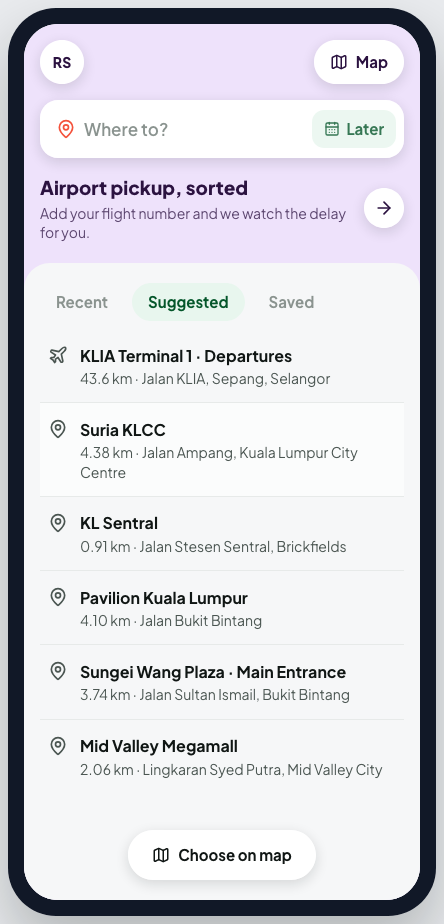<br><sub><b>R01 · Where to</b><br>Places search via the backend</sub></td>
    <td align="center">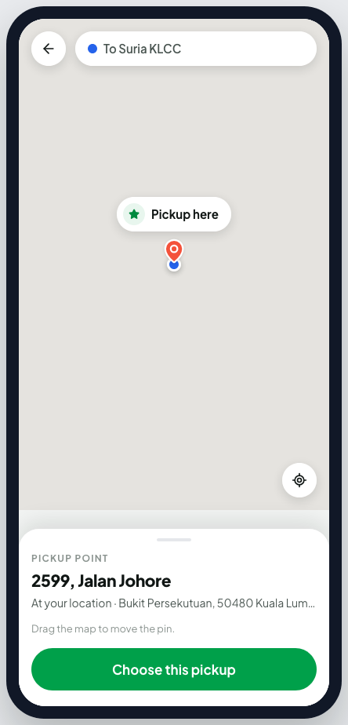<br><sub><b>R02 · Confirm pickup</b><br>Drag the pin, reverse-geocoded</sub></td>
    <td align="center">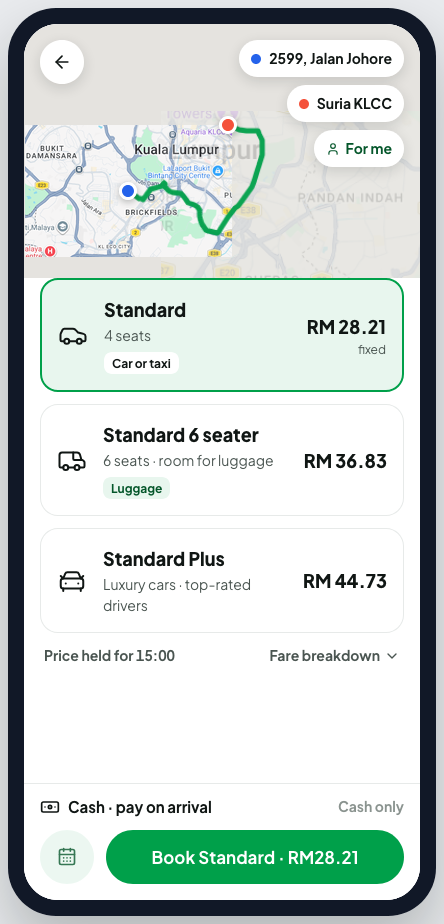<br><sub><b>R03 · Pick a ride</b><br>Live fare estimate per tier</sub></td>
    <td align="center">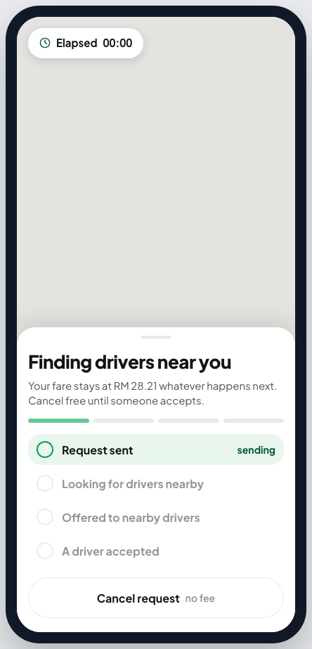<br><sub><b>R04 · Finding a driver</b><br>Dispatch progress, free cancel</sub></td>
  </tr>
  <tr>
    <td align="center">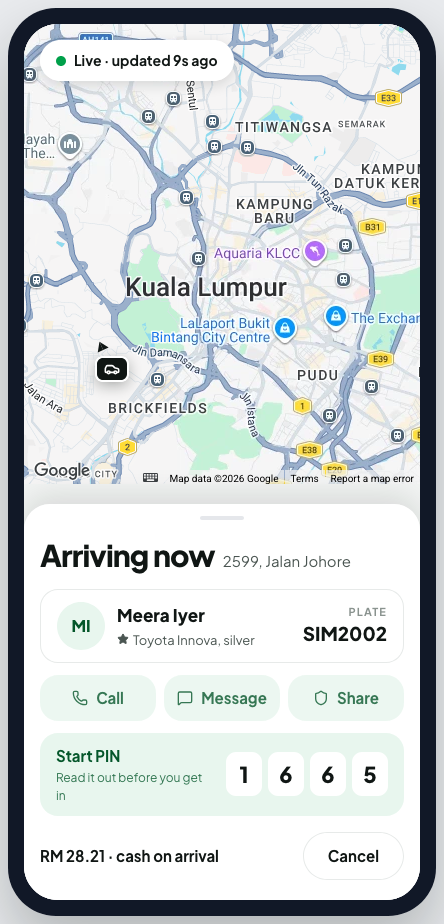<br><sub><b>R05 · Driver on the way</b><br>Live location, plate, start PIN</sub></td>
    <td align="center">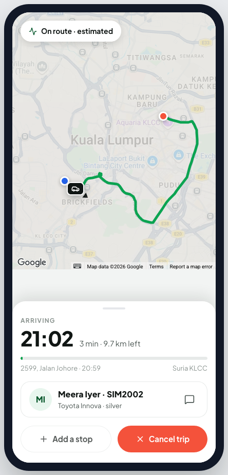<br><sub><b>R06 · On trip</b><br>Progress along the booked route</sub></td>
    <td align="center">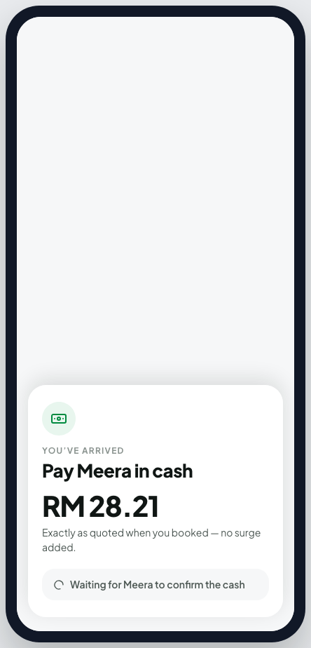<br><sub><b>Pay your driver</b><br>Cash, exactly as quoted</sub></td>
    <td align="center">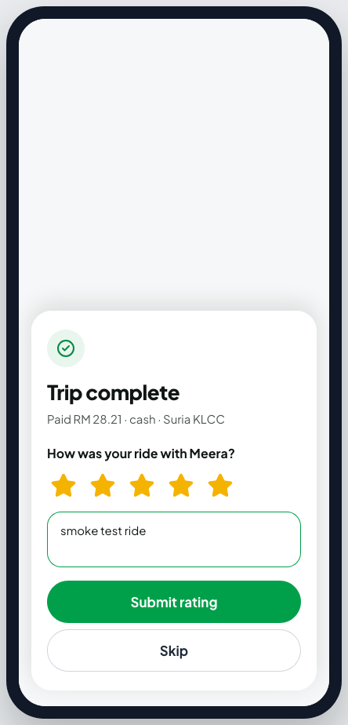<br><sub><b>Trip complete</b><br>Rate the driver</sub></td>
  </tr>
</table>

### Driver app — `/driver`

<table>
  <tr>
    <td align="center">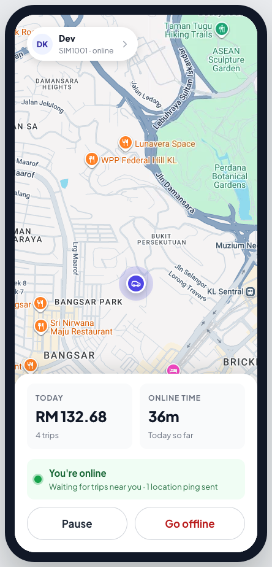<br><sub><b>D06 · Online</b><br>Earnings, online time, location pings</sub></td>
    <td align="center">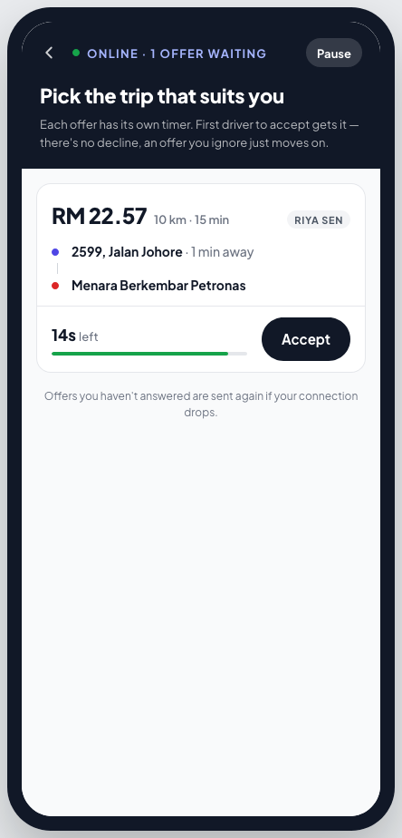<br><sub><b>D08 · Job offer</b><br>Per-offer countdown, accept-only</sub></td>
    <td align="center">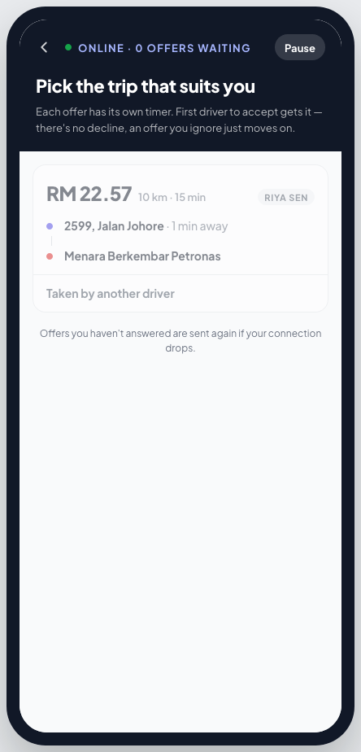<br><sub><b>D08 · Taken</b><br>Another driver won the race</sub></td>
  </tr>
  <tr>
    <td align="center">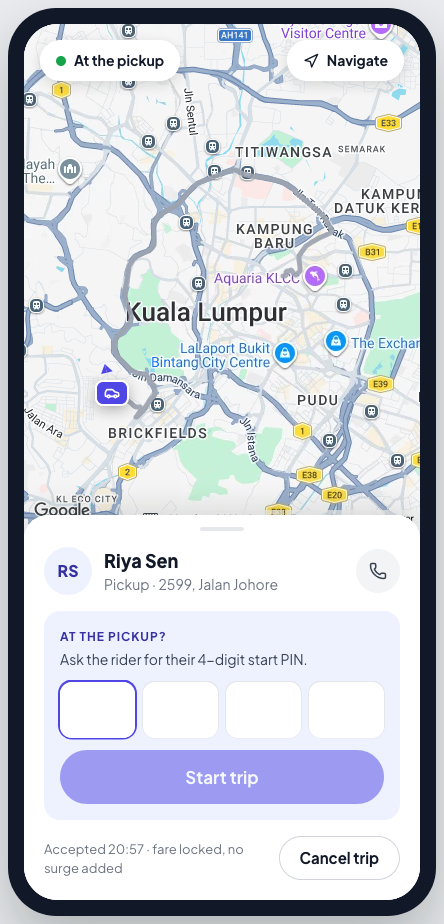<br><sub><b>D09 · At the pickup</b><br>Start with the rider's 4-digit PIN</sub></td>
    <td align="center">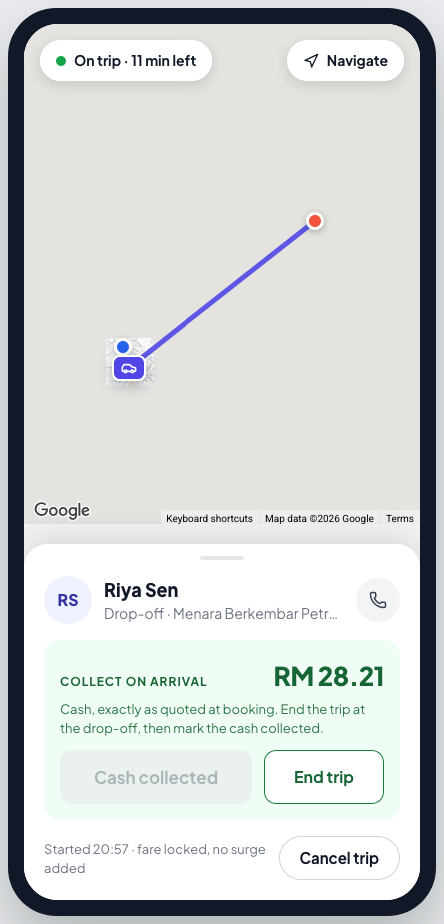<br><sub><b>D09 · On trip</b><br>End trip, then collect cash</sub></td>
    <td align="center">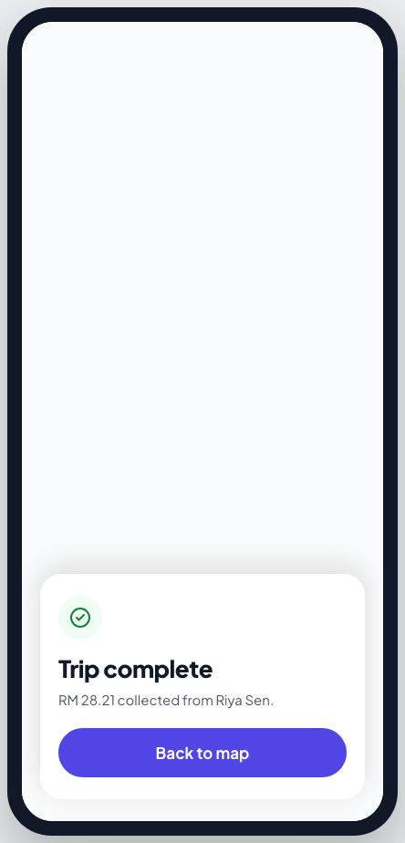<br><sub><b>Trip complete</b><br>Cash collected, back to the map</sub></td>
  </tr>
</table>

### When things go wrong

<table>
  <tr>
    <td align="center">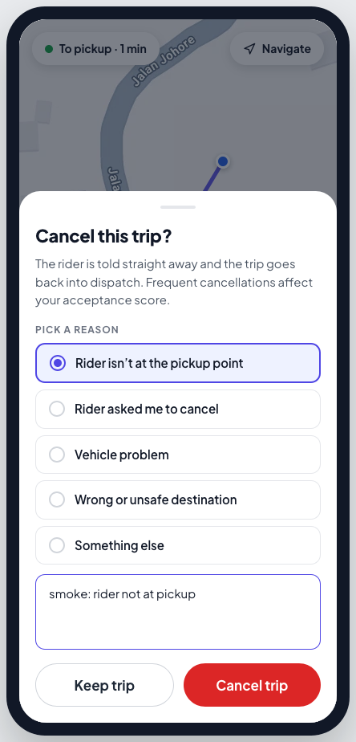<br><sub><b>D10 · Driver cancels</b><br>A reason is always required</sub></td>
    <td align="center">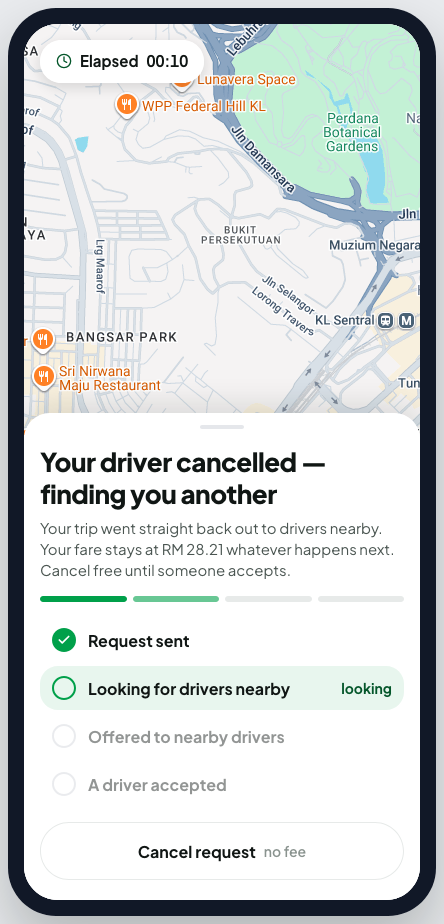<br><sub><b>Redispatch</b><br>The rider's trip goes straight back out, same fare</sub></td>
  </tr>
</table>

### The simulator — `/simulator`

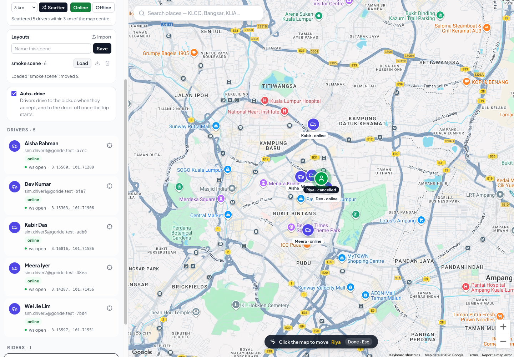

The control room. Every open tab shows as a marker, coloured by role and state. From here you can:

| Tool | What it does |
|---|---|
| **Place** | Select a tab, click the map (or drag its marker). A place search jumps to KLCC, KL Sentral, KLIA and so on. |
| **Quick setup** | *Open N* opens N tabs, and each one signs itself in as a free test account. |
| **Scatter** | Drops every driver at random within 0.5, 1.5 or 3 km of the map centre. |
| **Online / Offline** | Asks each driver tab to switch, using its own token, and reports who couldn't and why. |
| **Drive** | Plays a driver along the real road route to the pickup, then the booked route to the drop-off. ×1/×2/×5/×10, pause, stop. |
| **Auto-drive** | Drivers start driving on accept and again on trip start, with no clicks. |
| **Layouts** | Save a scene (who stands where, who's online) by name, reload it later, and export or import it as JSON. |

### The dev panel: see the protocol happen

Beside every phone is a live log of what that tab is doing on the wire.

<table>
  <tr>
    <td align="center" width="50%">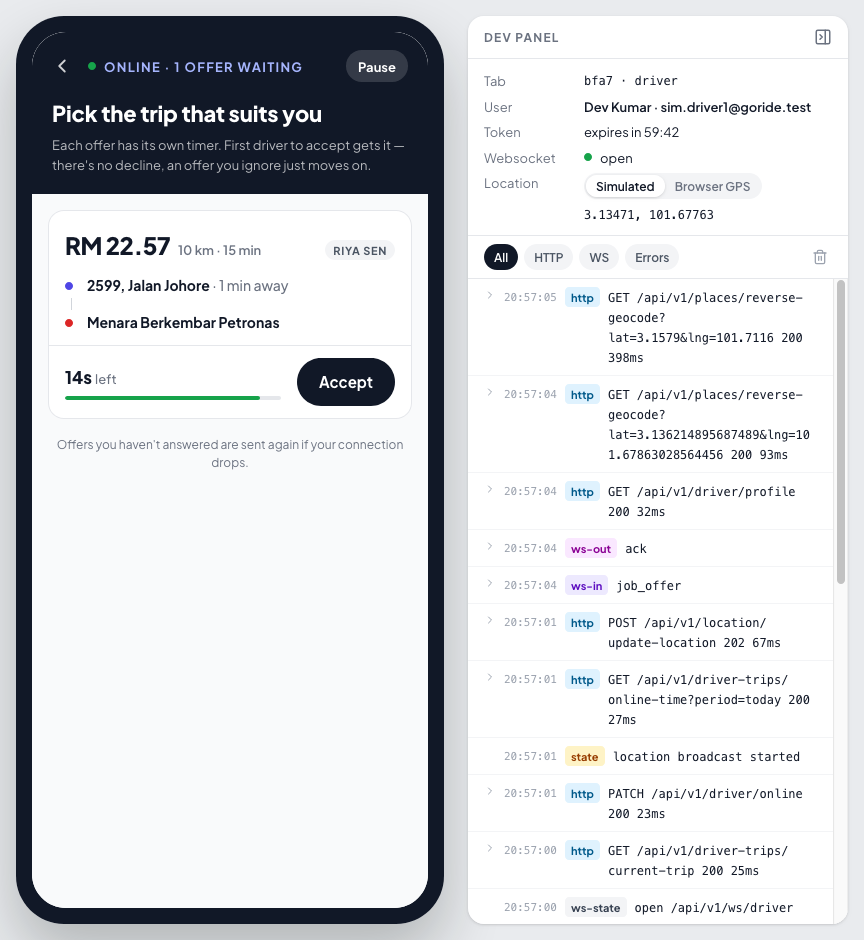<br><sub><b>Driver gets an offer.</b> <code>PATCH /driver/online</code> → location broadcast → <code>ws-in job_offer</code> → <code>ws-out ack</code></sub></td>
    <td align="center" width="50%">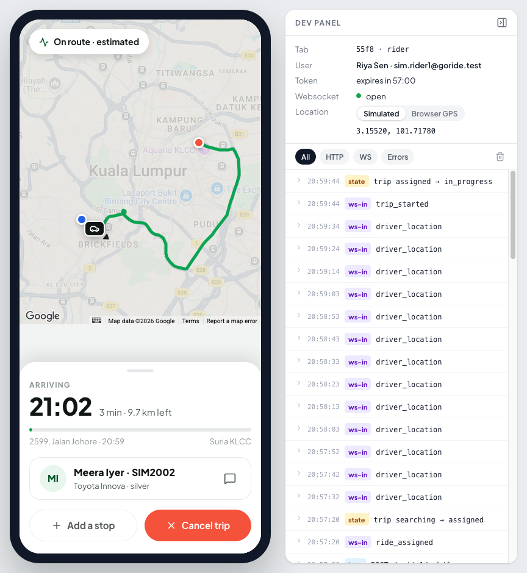<br><sub><b>Rider watches the approach.</b> <code>ride_assigned</code>, a <code>driver_location</code> every ~10 s, then <code>trip_started</code></sub></td>
  </tr>
</table>

---

## Workflow

### Setting up a scene in about 30 seconds

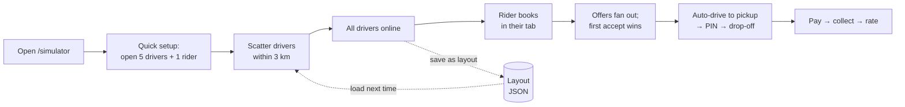
```mermaid
flowchart LR
    A["Open /simulator"] --> B["Quick setup:<br/>open 5 drivers + 1 rider"]
    B --> C["Scatter drivers<br/>within 3 km"]
    C --> D["All drivers online"]
    D --> E["Rider books<br/>in their tab"]
    E --> F["Offers fan out;<br/>first accept wins"]
    F --> G["Auto-drive to pickup<br/>→ PIN → drop-off"]
    G --> H["Pay → collect → rate"]
    D -. "save as layout" .-> L[("Layout<br/>JSON")]
    L -. "load next time" .-> C
```

### One ride, end to end

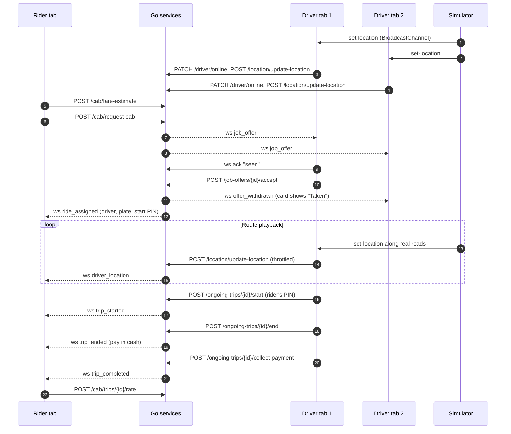
```mermaid
sequenceDiagram
    autonumber
    participant R as Rider tab
    participant API as Go services
    participant D1 as Driver tab 1
    participant D2 as Driver tab 2
    participant S as Simulator

    S->>D1: set-location (BroadcastChannel)
    S->>D2: set-location
    D1->>API: PATCH /driver/online, POST /location/update-location
    D2->>API: PATCH /driver/online, POST /location/update-location
    R->>API: POST /cab/fare-estimate
    R->>API: POST /cab/request-cab
    API-->>D1: ws job_offer
    API-->>D2: ws job_offer
    D1->>API: ws ack "seen"
    D1->>API: POST /job-offers/{id}/accept
    API-->>D2: ws offer_withdrawn (card shows "Taken")
    API-->>R: ws ride_assigned (driver, plate, start PIN)
    loop Route playback
        S->>D1: set-location along real roads
        D1->>API: POST /location/update-location (throttled)
        API-->>R: ws driver_location
    end
    D1->>API: POST /ongoing-trips/{id}/start (rider's PIN)
    API-->>R: ws trip_started
    D1->>API: POST /ongoing-trips/{id}/end
    API-->>R: ws trip_ended (pay in cash)
    D1->>API: POST /ongoing-trips/{id}/collect-payment
    API-->>R: ws trip_completed
    R->>API: POST /cab/trips/{id}/rate
```

### Trip state, as the rider sees it

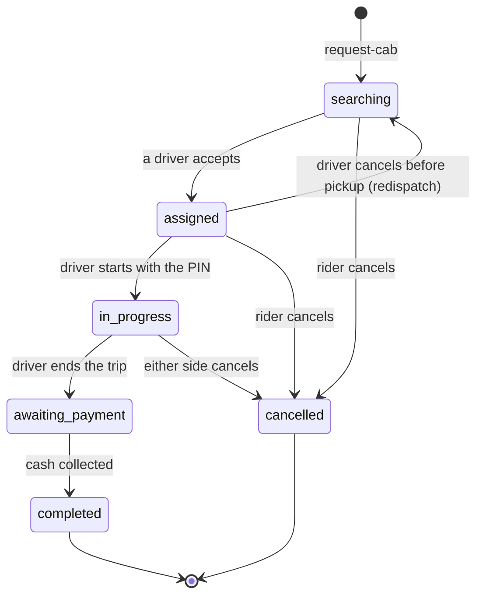
```mermaid
stateDiagram-v2
    [*] --> searching: request-cab
    searching --> assigned: a driver accepts
    assigned --> searching: driver cancels before pickup (redispatch)
    assigned --> in_progress: driver starts with the PIN
    in_progress --> awaiting_payment: driver ends the trip
    awaiting_payment --> completed: cash collected
    searching --> cancelled: rider cancels
    assigned --> cancelled: rider cancels
    in_progress --> cancelled: either side cancels
    completed --> [*]
    cancelled --> [*]
```

---

## Architecture

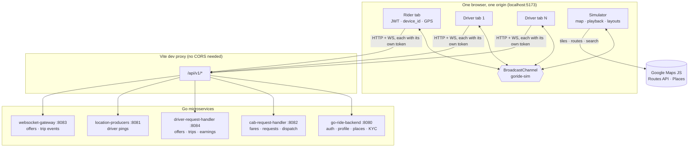
```mermaid
flowchart TB
    subgraph Browser["One browser, one origin (localhost:5173)"]
        direction LR
        R1["Rider tab<br/>JWT · device_id · GPS"]
        D1["Driver tab 1"]
        D2["Driver tab N"]
        SIM["Simulator<br/>map · playback · layouts"]
        BUS{{"BroadcastChannel<br/>goride-sim"}}
        R1 <--> BUS
        D1 <--> BUS
        D2 <--> BUS
        SIM <--> BUS
    end

    subgraph Vite["Vite dev proxy (no CORS needed)"]
        P["/api/v1/*"]
    end

    subgraph Go["Go microservices"]
        B["go-ride-backend :8080<br/>auth · profile · places · KYC"]
        C["cab-request-handler :8082<br/>fares · requests · dispatch"]
        DR["driver-request-handler :8084<br/>offers · trips · earnings"]
        L["location-producers :8081<br/>driver pings"]
        WS["websocket-gateway :8083<br/>offers · trip events"]
    end

    GM[("Google Maps JS<br/>Routes API · Places")]

    R1 & D1 & D2 -- "HTTP + WS, each with its own token" --> P
    P --> B & C & DR & L & WS
    SIM -- "tiles · routes · search" --> GM
```

**Design decisions worth calling out**

- **A login belongs to a tab, not the browser.** The token lives in `sessionStorage`, so it survives a reload and
  ends when the tab closes. A per-tab UUID becomes the websocket `device_id`, so two tabs signed in as the same
  driver don't kick each other off the gateway.
- **The simulator never impersonates anyone.** It has no login. It sends commands over the bus (`set-location`,
  `set-online`, `nav-route`), and each tab makes the API call with its own credentials. The backend sees exactly
  what it would see from phones.
- **Same origin on purpose.** `BroadcastChannel` only works between same-origin tabs, and one Vite proxy can front
  all five services, so the Go code needed no CORS changes.
- **Realistic pings.** Driver tabs port the mobile app's location broadcaster (movement at least 10 s apart,
  heartbeat every 60 s), so dispatch sees real-world ping rates even at ×10 playback.
- **Wall-clock playback.** Route playback is anchored to the wall clock and ticks from a Web Worker, so it keeps
  going in background tabs. The route is published on the bus so both apps render the same path and ETA.

---

## Tech stack

| Concern | Choice |
|---|---|
| Build | Vite 8 · React 19 · TypeScript |
| Routing | React Router 7 |
| Server / client state | TanStack Query · Zustand |
| Forms | react-hook-form + zod (schemas shared with the mobile apps) |
| Styling | Tailwind CSS 4 with the mobile apps' theme tokens · Plus Jakarta Sans · Lucide icons |
| Maps | Google Maps JS via `@vis.gl/react-google-maps` · Routes API · Places API |
| Realtime | Native WebSocket with exponential-backoff reconnect · `BroadcastChannel` tab bus |
| Tests | Vitest + Testing Library (unit) · `puppeteer-core` over WebDriver BiDi on Firefox (multi-tab E2E) |

---

## Getting started

### Prerequisites

- Node 20.19+ or 22.12+
- The Go Ride services running locally (`scripts/run-all.sh` at the workspace root)
- A Google Maps browser key with Maps JavaScript, Routes and Places (New) enabled

### Run

```bash
cp .env.example .env        # set VITE_GOOGLE_MAPS_API_KEY
npm install
npm run dev                 # http://localhost:5173
```

| Route | What it is |
|---|---|
| `/user` | Rider app |
| `/driver` | Driver app |
| `/simulator` | Map, tab list and tools |
| `/health` | Pings every Go service through the dev proxy |

The dev server proxies `/api/v1/*` to the services. Override targets with `PROXY_*` in `.env`.

| Prefix | Service | Default |
|---|---|---|
| `/api/v1/cab` | cab-request-handler | `:8082` |
| `/api/v1/driver-trips` | driver-request-handler | `:8084` |
| `/api/v1/location` | location-producers | `:8081` |
| `/api/v1/ws` | websocket-gateway | `:8083` |
| `/api/v1`, `/healthz` | go-ride-backend | `:8080` |

### Test accounts

Test accounts are defined in go-ride-backend's
[`config/test-accounts.yaml`](../go-ride-backend/config/test-accounts.yaml): 5 riders (`sim.rider1–5@goride.test`)
and 8 drivers (`sim.driver1–8@goride.test`) with a mix of standard, 7-seat and luxury vehicles, all with password
`password123`. In go-ride-backend:

```bash
# .env (gitignored): enables GET /api/v1/dev/test-accounts and the seed
DEV_TOOLS_ENABLED=true

make seed      # creates the accounts, or resets them (KYC, vehicle, documents, password)
```

Restart go-ride-backend afterwards. Quick setup then opens signed-in tabs for you. You can also sign a tab in
directly with `/driver/login?as=<email>` or `/user/login?as=<email>`. The password is fetched from the dev
endpoint and never appears in the URL.

> Fares show in MYR because cab-request-handler's local `.env` sets `FARE_CITY_CODE=KUL`. Without it, the backend
> prices in USD.

### Location sources

Each tab's position comes from a location source you can switch in the dev panel:

- **Simulated** (default): set from the simulator, and kept across a reload of that tab.
- **Browser GPS**: `navigator.geolocation`. The simulator shows these tabs but can't move them.

---

## Testing

```bash
npm run typecheck
npm run lint
npm test                    # 199 unit tests (Vitest)
npm run smoke:firefox       # multi-tab E2E; needs `npm run dev`, the Go stack and go-ride-postgres
npm run handoff:shots -- "../design_handoff_go_ride/Driver App.dc.html" "08 Job offers"   # render a design screen
```

`smoke:firefox` drives the local Firefox (`/Applications/Firefox.app`, or set `FIREFOX_PATH`; `SMOKE_HEADFUL=1`
to watch) with one rider and several drivers in parallel pages. It covers:

- **Sessions and map:** per-tab isolation; simulator placement reaching each tab.
- **Driver flow:** go online → location ping stored in the DB → offer → seen-ack → accept.
- **Booking race:** both online drivers get the offer; one accepts and the other sees "Taken"; the rider sees the
  plate and PIN.
- **Lifecycle:** driver cancels → redispatch to driver 2 → wrong PIN, then right PIN → end → pay → collect →
  rate; then a rider cancel mid-trip.
- **Route playback:** auto-drive with every stored ping on the route; the same route in both apps; the ETA
  counting down to "Arriving now"; pause; a manual move stopping the drive.
- **Quick setup:** open 3 drivers that sign themselves in, scatter, take them online, book, restore a layout.

It resets the accounts it touches before and after. Screenshots go to `test-results/smoke/`; the images in this
README come from those runs.

---

## Project structure

```
src/
  app/                 routes: home, health, simulator
  features/
    auth/              login, signup, auto sign-in (?as=)
    rider/             rider screens and runtime
    driver/            driver screens and runtime
    simulator/         map, tab registry, markers, commands
      drive/           route source, playback store, ticker, auto-drive
  shared/
    api/               http client with dev-log hook, typed service clients
    session/           per-tab session store
    tab/               tab identity, BroadcastChannel bus, presence, duplicate-tab guard
    realtime/          websocket client with reconnect
    location/          simulated / browser location provider
    route/             polyline codec, geometry, snapping, speed profile
    devlog/            event log store and dev panel
    map/  places/  ui/  lib/
scripts/
  smoke-firefox.mjs    multi-tab end-to-end run
  handoff-shots.mjs    renders design-handoff screens for side-by-side checks
```

---

## Roadmap

- [x] Foundation: per-tab sessions, proxy, tab bus, websocket client
- [x] Simulator skeleton and location spoofing
- [x] Driver path to receiving offers
- [x] Rider booking happy path
- [x] Trip completion, cancellation and redispatch
- [x] Real-road route playback
- [x] Test accounts, quick setup, scatter and layouts
- [ ] Remaining screens: rider profile, driver profile and earnings, vehicles, KYC verification hub
- [ ] Event timeline across all tabs and a trip-inspector state machine

The design and phase notes are in [PLAN.md](PLAN.md); checkpoints and next tasks are in [PROGRESS.md](PROGRESS.md).
